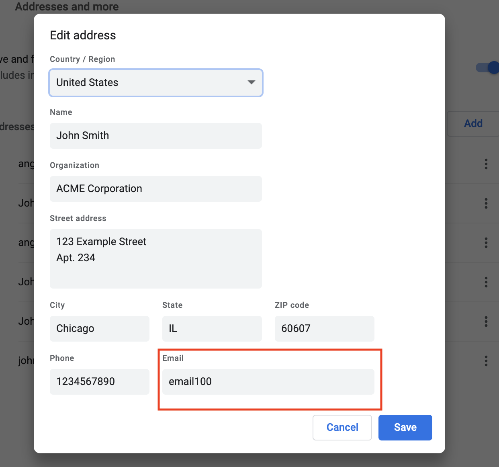
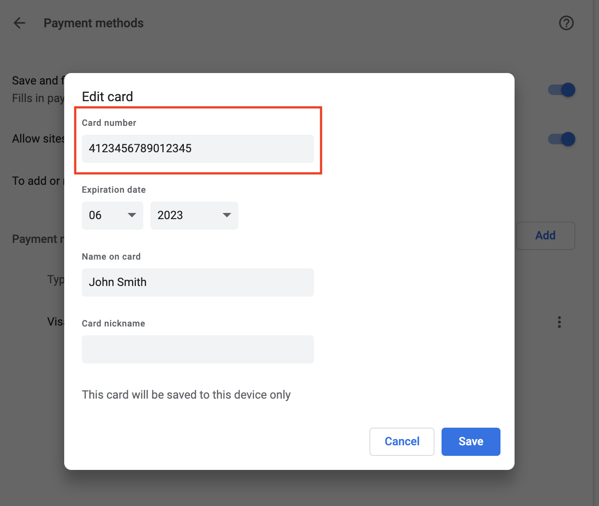
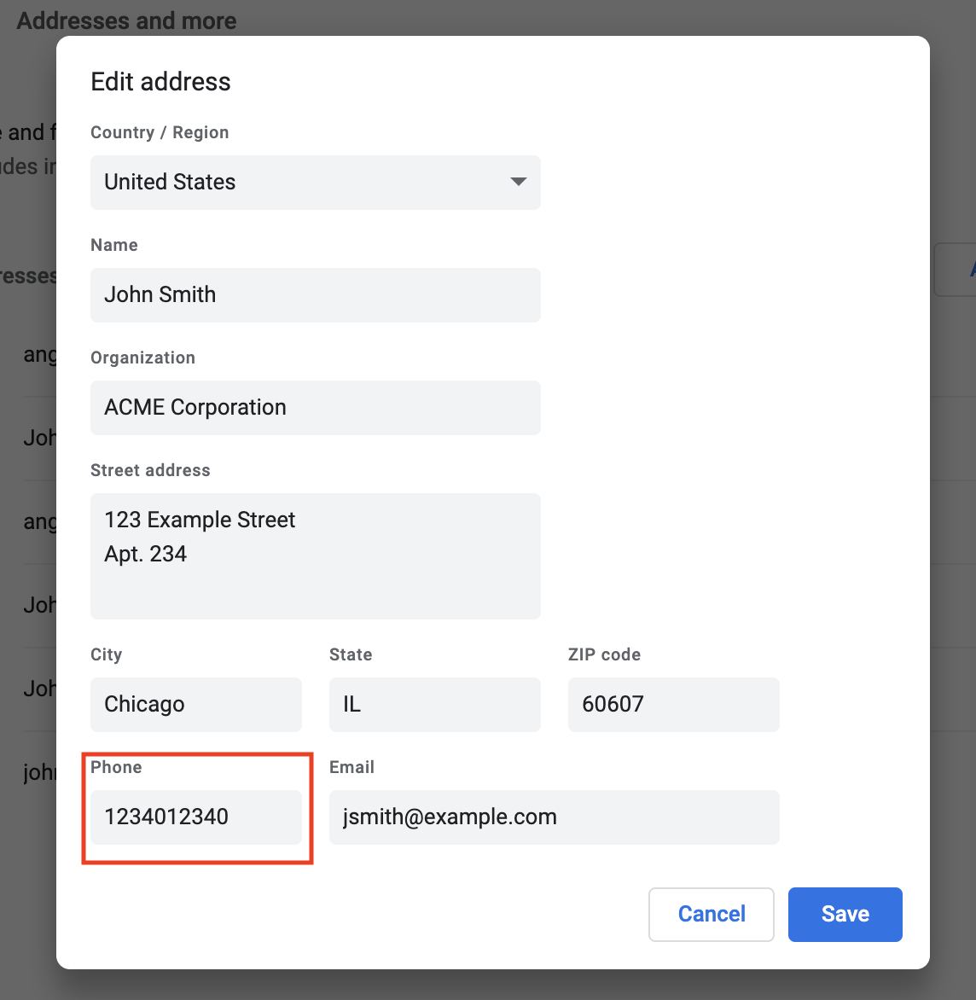

# Privacy threats of browser form autofill

- [Attack Demos](#Attack-demos)
    - [Inter email address from multiple profiles](#Inter-email-address-from-multiple-profiles)
    - [Infer credit card number from 100k candidate values](#Infer-credit-card-number-from-100k-candidate-values)
    - [Infer phone number from 100k candidate values](#Infer-phone-number-from-100k-candidate-values)
    - [Generate and distribute candidate values](#Generate-and-distribute-candidate-values)
- [Extension](#Extension)
- [Crawling](#Crawling)
    - [Patch](#Patch)
    - [Crawler](#Crawler)
- [Data](#data)
- [Research Paper](#Research-Paper)

## Attack demos
A novel, complicated side-channel attack that exploits browser’s autofill preview functionality to infer information in user's profile.

The demos are for **educational** and **demonstration** purposes only!

### Installation
The **attack_demos** folder needs to be uploaded to the public folder on webserver.

### Inter email address from multiple profiles

multiple_emails.html: obtain the email addresses from multiple profiles in the autofill.

The page infers the email address from 40,463 candidate values.

Affected browsers: all Chromium-based browsers.

Affected versions: all.

1. Set up the address profile on Chrome.

Settings -> Autofill -> Addresses and more.

Set the email address between [email0, email40462]. You may have multiple profiles.

<p align="center">

</p>

2. Visit the page at  http://yourdomain.com/attack_demos/multiple_emails.html

3. Click the input field and mouse over different profiles. The page displays the results immediately.

### Infer credit card number from 100k candidate values
preview_cc.html: infer user's credit card number from 102k candidate values. Payment autofill requires **https** connection.

Affected browsers: all Chromium-based browsers.

Affected versions: prior to 84.0.4147.89.

1. Set up the payment profile on Chrome.

Settings -> Autofill -> Payment methods

Set the credit card number between [4123456789000000 - 4123456789100333].
<p align="center">

</p>

2. Visit the page at https://yourdomain.com/attack_domos/preview_cc.html.

3. Click the input field and mouse over the profile. There are a few seconds delay before the page shows the result, depending on the device.

### Infer phone number from 100k candidate values
preview_phone.html: infer user's phone number from 102k candidate values.

Affected browsers: all Chromium-based browsers.

Affected versions: prior to 84.0.4147.89.

1. Set up the address profile on Chrome.

Settings -> Autofill -> Addresses and more.

Set the phone number between [1234000000 - 1234100866].

<p align="center">

</p>

2. Visit the page at  http://yourdomain.com/attack_demos/preview_phone.html

3. Click the input field and mouse over the profile. There are a few seconds delay before the page shows the result, depending on the device.
### Generate and distribute candidate values
1. generate and distribute 40k email addresses to 199 &lt;select> elements. 
```python
python3 attack_demos/menu_generator_py/generate_html.py
```
2. generate and distribute 100k phone numbers to 198 &lt;select> elements.
```python
python3 attack_demos/menu_generator_py/generate_html_phone.py
```
3. generate and distribute 100k credit card numbers to 198 &lt;select> elements.
```python
python3 attack_demos/menu_generator_py/generate_html_cc.py
```
## Extension
A chrome extension that detects autofillable, hidden elements in a visitied page. It shows a warning message on **lax mode**, and remove these hidden elements on **strict mode**.

## Crawling

### Patch
We provide the source code modification as a patch to Chromium.
### Crawler
The crawler is running on top of Selenium and an intrumented Chromium (Version 81.0.4009.0) / Firefox (Nightly Version 74).

## Data
In a crawl conducted during November 2019, these web pages were found to have hidden HTML elements autofilled by Chrome/Firefox.

## Research Paper
You can read more about the details of our work in the following research paper:

**Fill in the Blanks: Empirical Analysis of the Privacy Threats of Browser Form Autofill**

If you use our code, data, or otherwise conduct research related to our work, please cite our paper [PDF](https://dl.acm.org/doi/pdf/10.1145/3372297.3417271):
``` tex
@inproceedings{lin2020fill,
  title={Fill in the Blanks: Empirical Analysis of the Privacy Threats of Browser Form Autofill},
  author={Lin, Xu and Ilia, Panagiotis and Polakis, Jason},
  booktitle={Proceedings of the 2020 ACM SIGSAC Conference on Computer and Communications Security},
  pages={507--519},
  year={2020}
}
```